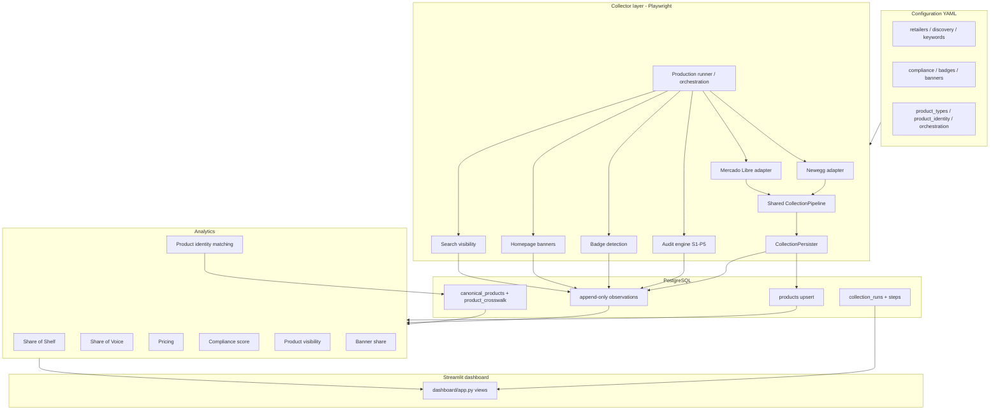
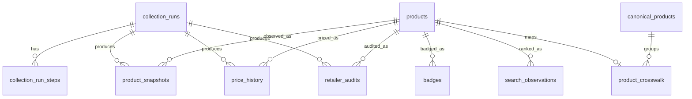

# BridgeAI — End-to-End Project Report (`first_report.md`)

**Report type:** Documentation / audit (read-only inspection of repository + PostgreSQL)  
**Report generated:** 2026-08-13  
**Database inventory measured at (UTC):** `2026-08-13T14:49:27.788051+00:00`  
**Database:** PostgreSQL `localhost:5433/bridgeai` · Alembic head `0006_canonical_product_identity`  
**Latest pytest:** **375 passed**, exit code `0` (2026-08-13, local run)  
**Scope rule:** This report documents what is **actually implemented, tested, and/or executed**. Items that cannot be verified are marked **NOT VERIFIED**, **NOT IMPLEMENTED**, or **LIMITATION**.

---

## 1. Executive summary

### What are we building?

BridgeAI is a **Retail Competitive Intelligence** platform that collects real product and marketing observations from two retailers—**Newegg (US)** and **Mercado Libre (Brazil)**—stores them historically in PostgreSQL, and analyzes how **Intel, AMD, Qualcomm, and Apple** are priced, promoted, displayed (badges/banners), audited for brand compliance (S1–S2 / P1–P5), and ranked in search/shelf visibility.

### Why collect retailer data?

The business goal is to compare brand positioning across retailers and countries without fabricating results: track prices and promotions over time, measure shelf and search presence, score compliance against explicit checks, and surface actionable comparisons for notebooks/desktops and related gaming computing products.

### Business questions the system is designed to answer (supported by implementation)

| Question | Supported today? |
|---|---|
| Which brands have the highest Share of Shelf (gaming-eligible universe)? | **YES** (data exists; notebook-heavy) |
| Which retailer has stronger brand presence (SoS / SoV / banners)? | **PARTIAL** (SoS/SoV stronger on Newegg; ML limited) |
| Which brand has the highest search visibility / Share of Voice? | **PARTIAL** (Newegg usable; ML partial/empty for exact SoV) |
| Which product has the highest visibility on Newegg? | **YES** |
| Which product has the highest visibility on Mercado Libre? | **PARTIAL** (sparse ML search data) |
| Which **same** product has highest combined visibility across both retailers? | **NO** (0 `MATCHED` crosswalk rows) |
| Which brands have the highest average price / discounts? | **YES** (per currency; USD and BRL never mixed) |
| Which products have changed price? | **YES** (append-only `price_history`; analytics exist) |
| Which brands have the highest overall compliance score? | **PARTIAL** (notebook segment scores exist; **overall N/A** — no desktop scored data) |
| Where are products missing expected badges / failing audits? | **YES** (audits + badge observations) |
| Which retailer has more tracked-brand homepage banners? | **YES** (Newegg has tracked brands; ML banners largely UNKNOWN) |

### Current overall status (one line)

**READY WITH LIMITATIONS** — core collectors, schema, analytics, dashboard, and tests exist and have been executed against real local PostgreSQL data, but Mercado Libre PDP/search access, desktop inventory, cross-retailer matches, overall compliance, and production scheduling/deployment remain limited or unverified.

---

## 2. Project scope

### Retailers & countries (configured + present in DB)

| Retailer | Country | Currency | Config enabled | Products in DB |
|---|---|---|---|---|
| Newegg | US | USD | yes | **21** |
| Mercado Libre | BR | BRL | yes | **24** |

### Tracked brands / platforms (configured)

Intel · AMD · Qualcomm · Apple

### OEMs (configured)

Dell · HP · Lenovo · Acer · Asus · MSI · Apple

### Product types (configured)

**Included:** notebook, desktop, workstation, tablet, cpu, gpu  
**Excluded categories (config):** monitors, keyboards, cameras, gift cards, accessories, mice, headsets, speakers, docking stations, bags, cables, adapters, memory, storage drives, motherboards, PSUs, cases, cooling

### Product types **actually represented in the current database**

| product_type | Count |
|---|---|
| notebook | 40 |
| UNKNOWN | 5 |
| desktop / workstation / tablet / cpu / gpu | **0** |

### Brands **actually represented**

| brand | Count |
|---|---|
| Intel | 26 |
| AMD | 12 |
| UNKNOWN | 7 |
| Qualcomm | **0** |
| Apple | **0** |

---

## 3. High-level architecture



### Layer roles

| Layer | Role | Shared vs retailer-specific |
|---|---|---|
| Playwright / `BrowserSession` | Browser automation (CDP or local) | Shared |
| Newegg adapter (`collector/retailers/newegg/`) | Discovery, listing, PDP parsing for Newegg US | Retailer-specific |
| Mercado Libre adapter (`collector/retailers/mercadolibre/`) | Discovery (primary search + secondary ofertas), listing-only enrichment, PT-aware parse, classification | Retailer-specific |
| `CollectionPipeline` | Discover → enrich → classify/scope → dedupe → persist | Shared |
| `CollectionPersister` | Upsert product identity; append snapshots/prices/promos; optional audit/badge hooks | Shared |
| PostgreSQL + SQLAlchemy | System of record | Shared |
| Analytics modules | SoS, SoV, pricing, compliance, banners, visibility, identity | Shared queries; retailer filters |
| Streamlit `dashboard/` | Read-only presentation; does **not** run Playwright | Shared |
| `python -m collector.run` | Production one-shot orchestration | Shared |

---

## 4. Data collection methodology

### End-to-end product collection flow

```text
Discovery URLs / queries
  → Candidate extraction (listing cards)
  → In-run SKU deduplication
  → Fetch / enrich product (PDP when available; listing-only when blocked)
  → Classification / scope validation
  → Product master upsert (retailer_code, country_code, retailer_sku)
  → Append product_snapshots (+ price_history / promotions when priced)
  → Downstream: audits, badges, banners, search (separate steps/runs)
```

### What `--limit 20` means

In `CollectionPipeline.run(limit=...)` and orchestration (`product_limit_per_retailer: 20` in `config/orchestration.yaml`):

1. Discovery requests up to about **`limit * 2`** candidates (overscan).
2. The pipeline stops after **`limit` successful in-scope products** are persisted (`outcome.success`).
3. It is **not** “20 database inserts blindly,” and it is **not** “only 20 candidates discovered.”

### Outcome vocabulary (pipeline)

| Term | Meaning |
|---|---|
| Discovered candidates | Listing cards found before enrichment |
| Valid / successful products | Passed scope checks and were persisted |
| New products | First upsert for that retailer SKU identity |
| Re-observed products | Same identity upserted again; new snapshot/history rows appended |
| Duplicates (in-run) | Same SKU seen again in the same run → skipped |
| Failed products | Enrichment/persist exception for that candidate |
| Skipped irrelevant | Out of collection scope / classification exclude |

### Why repeated collection does not duplicate product masters

`products` has a unique constraint on `(retailer_code, country_code, retailer_sku)`. Repositories **upsert** identity attributes and update `last_seen_at`. Observation tables are **append-only**.

---

## 5. Product identity

### Retailer-scoped identity (master)

Primary key of marketplace reality for this project:

```text
(retailer_code, country_code, retailer_sku)
```

Newegg and Mercado Libre listings are **always separate `products` rows**, even if they are the same physical laptop. Collapsing them into one retailer product row is intentionally forbidden.

### Cross-retailer canonical layer

| Table | Purpose |
|---|---|
| `canonical_products` | Optional real-world identity (analytics layer) |
| `product_crosswalk` | Maps each `products.id` → canonical + match status |

**Statuses:** `MATCHED` · `POSSIBLE_MATCH` · `UNMATCHED`

**Matching tiers** (`config/product_identity.yaml` + `analytics/product_identity/matching.py`):

| Tier | Evidence | Can become MATCHED? |
|---|---|---|
| 1 | Exact GTIN / UPC / EAN | Yes (high confidence) |
| 2 | MPN / manufacturer model (+ OEM requirements) | Yes if thresholds met |
| 3 | Supporting evidence / weaker signals | **POSSIBLE_MATCH only** |

**Title-only similarity is capped** (`title_similarity_cap: 0.45`) and **cannot alone produce MATCHED**.

### How visibility questions map

| Question | Mechanism |
|---|---|
| A. Highest visibility on Newegg | `highest_visibility_by_retailer(session, "newegg")` over `search_observations` |
| B. Highest visibility on Mercado Libre | same API with `"mercadolibre"` |
| C. Same product across both | Only rows with crosswalk `MATCHED` on both retailers |

### Current matching results (DB)

| match_status | Count |
|---|---|
| UNMATCHED | **45** |
| POSSIBLE_MATCH | **0** |
| MATCHED | **0** |
| canonical_products | **45** (one per retailer product; no merges) |

**Interpretation:** Zero MATCHED does **not** prove the retailers share no common SKUs. It means **no reliable common identity has been established** (often lacking GTIN/MPN evidence, especially when ML PDP is blocked).

---

## 6. Database design

### Core tables (inspected from `database/models.py` + migrations)

| Table | Purpose | Historical? | Write mode |
|---|---|---|---|
| `collection_runs` | Run metadata | metadata | insert + finalize status |
| `collection_run_steps` | Per-component orchestration status | metadata | insert + finalize |
| `products` | Retailer-scoped master identity (latest attrs) | **current** | **upsert** |
| `product_snapshots` | Full product observation incl. price/promo fields | historical | **append-only** |
| `price_history` | Native-currency price ticks | historical | **append-only** |
| `promotions` | Promo/deal observations | historical | **append-only** |
| `retailer_audits` | S1/S2/P1–P5 results + evidence | historical | **append-only** |
| `badges` | Badge detections | historical | **append-only** |
| `banner_observations` | Homepage banner observations | historical | **append-only** |
| `search_observations` | Search SERP ranks / SoV | historical | **append-only** |
| `canonical_products` | Cross-retailer identity | analytics | rebuildable |
| `product_crosswalk` | Product ↔ canonical mapping | analytics | rebuildable |

### Simplified ER



---

## 7. Historical data strategy

| Concept | Behavior |
|---|---|
| **Current** | `products` latest title/brand/oem/type/URL/active flags |
| **Historical** | snapshots, prices, promotions, audits, badges, banners, searches |
| **Upserted** | product masters only |
| **Append-only** | all observation tables (repositories have no observation UPDATE helpers) |
| **Same product collected again** | master updated; new observation rows inserted with new `observed_at` |
| **Why history is not overwritten** | Competitive intelligence requires trends and auditability |

---

## 8. Evidence / access model

Implemented in `collector/evidence.py` and stored under `NormalizedProduct.raw_payload['evidence']` / snapshot `raw_payload`.

### Statuses

| Status | Meaning |
|---|---|
| COMPLETE | Surface inspected successfully |
| PARTIAL | Some surfaces complete, others missing/blocked |
| UNKNOWN | Not inspected / insufficient evidence |
| BLOCKED | Access prevented (verification, captcha, etc.) |

### Reason codes implemented

`pdp_blocked` · `account_verification` · `captcha` · `bot_challenge` · `not_inspected` · `selector_missing` · `pagination_incomplete` · `extraction_failed` · `listing_only` · `ok`

### Surfaces

`listing` · `search` · `category` · `pdp` · `specifications` · `badge` · `rich_media`

### Critical methodology rule

**BLOCKED PDP ≠ FAIL audit.**  
Missing / blocked / not-inspected evidence maps to audit **UNKNOWN**, never silent FAIL.

| Concept | Meaning |
|---|---|
| Not observed | Collector did not attempt / no row |
| Not present | Inspected; evidence looked for and absent → can be FAIL |
| Failed inspection | Technical failure → UNKNOWN |
| Blocked access | Retailer gate → BLOCKED evidence → UNKNOWN audits for gated checks |

**DB check:** Mercado Libre snapshots matching `pdp_blocked` / `account_verification` / `listing_only` evidence text: **74** rows (all ML).

---

## 9. Mercado Libre language handling

| Topic | Actual behavior |
|---|---|
| Site language | Portuguese (pt-BR) |
| Controlled vocabulary in DB/analytics | English codes (`notebook`, `Intel`, `PASS`, …) |
| Raw evidence | Preserved (titles, category_raw, raw_payload) |
| Chrome Translate | **NOT a production dependency** (`mercadolibre_discovery.yaml` documents this) |
| Parsing | Portuguese-aware aliases (e.g. `processador`, `memória ram`, `placa de vídeo`, `armazenamento`, promo/badge PT patterns in YAML) |

**LIMITATION:** Portuguese coverage is **partial by design** (alias lists), not a full translation engine.

---

## 10. Mercado Libre access limitations (retailer access, not “code forgot PDP”)

Documented in discovery config + collector/audit runners:

| Surface | Current behavior |
|---|---|
| Primary search/listing (`lista.mercadolivre.com.br`) | Often gated by account verification in automated CDP → recorded BLOCKED; collector continues |
| Secondary ofertas | Fallback enrichment when primary yields too few candidates |
| PDP | Frequently account-verification blocked → **listing-only enrichment** allowed |
| What can be collected | Titles, listing prices, some listing badges/text, classification from title |
| What often cannot | Full specs tables, rich media inspection, confident PDP badge evidence |

### Analytics affected

- Compliance P2–P5 frequently **UNKNOWN** on ML when PDP not inspected  
- Badge completeness lower on ML (27 badge rows vs 120 Newegg)  
- Search SoV for ML is **PARTIAL** / empty for exact basis  
- Cross-retailer MATCHED identity starved of GTIN/MPN from blocked PDPs  
- SoS gaming universe for ML currently tiny (**2** eligible vs **21** Newegg)

---

## 11. Product classification

### Two-stage ML classifier (`collector/retailers/mercadolibre/classification.py`)

1. **Hard negatives** (TV, power bank, supplement, exercise bike, smartphone, appliances, …) → **EXCLUDED**
2. **Positive signals** from title/category/specs aliases → type + **VALID** / **UNKNOWN**

Results: **VALID** | **UNKNOWN** | **EXCLUDED**

### Why discovery URL/slugs must not determine type

Discovery labels like `notebook_ofertas` are informational only. Classification ignores discovery-slug pollution (`_is_discovery_slug`) so ofertas junk cannot be forced to `notebook`.

### False-positive classes previously addressed (code + `product_types.yaml` signals)

Smart TV · power bank · supplements (whey/creatina) · exercise bike / spinning · smartphones · appliances · weak `computador` collisions

### Current DB validation snapshot

- 40 notebooks, 5 UNKNOWN product types  
- No desktop rows yet despite desktop discovery queries existing  
- Hard-negative exclusions are unit-tested (`tests/test_ml_hardening.py`, ML collector tests)

---

## 12. S1–S2 / P1–P5 brand compliance audits

| Code | Surface | Rule (brief + `config/compliance.yaml`) |
|---|---|---|
| S1 | Listing | Title includes brand and/or brand processor line |
| S2 | Listing | Brand badge on listing tile |
| P1 | PDP | Title includes brand / processor / generation |
| P2 | PDP | Brand badge on product page |
| P3 | PDP | Brand/processor in specification table |
| P4 | PDP | Brand-led rich media present |
| P5 | PDP | OEM rich media present |

**Results:** PASS | FAIL | UNKNOWN  
**Storage:** append-only `retailer_audits` (`evidence_text`, `details`, optional screenshot/url)  
**Missing evidence:** UNKNOWN; **never** auto-FAIL / auto-PASS

### Current audit inventory (DB)

| Metric | Value |
|---|---|
| Total audit rows | **1190** |
| Newegg | 840 |
| Mercado Libre | 350 |
| PASS | 877 |
| FAIL | 34 |
| UNKNOWN | 279 |

### Current compliance scoring (computed 2026-08-13 from DB)

Strategy: `equal_check_weights` (interim; individual S1–P5 weights **not** brief-authoritative).

| Brand | Notebook score | Desktop score | Overall (0.85/0.15) |
|---|---|---|---|
| Intel | ~98.06% | n/a | **N/A** |
| AMD | ~93.20% | n/a | **N/A** |
| Qualcomm | n/a | n/a | **N/A** |
| Apple | n/a | n/a | **N/A** |

**Why overall is N/A:** zero `desktop` products / scored desktop audits. Clarification C2 forbids silently renormalizing 85/15 onto notebook alone.

### Tests

`tests/test_audit_checks.py` (18) · `tests/test_compliance_score.py` (20) — included in the green full suite.

---

## 13. Badge detection

### Platform families (`config/badges.yaml`)

| Brand | Families |
|---|---|
| Intel | Core, Core Ultra, Evo, vPro |
| AMD | Ryzen, Ryzen AI |
| Qualcomm | Snapdragon |
| Apple | Apple Silicon, M-series |

Also detects promotional badges (best seller, sponsored, frete grátis, etc.).

### Evaluation outputs

expected · detected · correct · missing · ambiguous (via `collector/parsers/badges.py`)

### Evidence priority

DOM/text/alt/title first. **OCR fallback disabled by default** (`ocr_fallback_enabled: false`).

### Persistence & counts

Table `badges` · **147** rows (Newegg 120 · ML 27)  
Tests: `tests/test_badge_detection.py` (21)

---

## 14. Pricing & promotions

### Captured fields

Current price · list/original price · discount % · promo text · currency · timestamp (`product_snapshots` + `price_history` + `promotions`)

### Analytics (`analytics/pricing/`)

`average_price_by_brand` · `median_price_by_brand` · `average_discount` · `count_discounted_products` · `price_change_over_time` · `discount_change_over_time` · `compare_by_retailer` · `compare_by_country` · `compare_by_product_type`

### Currency rule

**USD (Newegg) and BRL (Mercado Libre) must not be silently mixed.** Analytics summarize per currency.

### Current pricing inventory

| Metric | Value |
|---|---|
| price_history | 107 (USD 33 · BRL 74) |
| promotions | 92 |
| Discounted products (latest analytics) | 33 |
| Average discount (cross latest obs) | ~34.5% |

Example brand averages (latest observations, **not** FX-converted):

| Brand | Currency | Avg price (approx) | Products |
|---|---|---|---|
| Intel | USD | 1407.93 | 15 |
| AMD | USD | 1238.39 | 5 |
| Intel | BRL | 4593.38 | 11 |
| AMD | BRL | 3663.80 | 7 |

---

## 15. Share of Shelf

### Formula

\[
\mathrm{SoS}(brand)=\frac{\text{eligible deduplicated tracked gaming listings for brand}}{\text{all eligible deduplicated tracked gaming listings}}
\]

**Universe id:** `sos_universe_v1` (`analytics/share_of_shelf/universe.py`)

### Inclusion rules

- Eligible types: notebook, desktop, workstation, tablet, cpu, gpu  
- Gaming signal required (title/category keywords)  
- Accessories / excluded categories out of denominator  
- OOS included (visibility metric)  
- Dedup by retailer SKU identity  
- Apple brand+OEM counted **once** toward Brand=Apple  

### Why accessories are excluded

SoS is a **computing shelf presence** metric for the brief’s product scope; accessories would inflate denominators and distort brand share.

### Current SoS (computed from DB)

| Scope | Universe | Intel | AMD | UNKNOWN |
|---|---|---|---|---|
| All | **23** | 73.91% (17) | 21.74% (5) | 4.35% (1) |
| Newegg | 21 | 71.43% (15) | 23.81% (5) | 4.76% (1) |
| Mercado Libre | **2** | 100% (2) | 0 | 0 |

**LIMITATION:** ML SoS is not comparable at scale yet (tiny eligible universe). No Qualcomm/Apple SoS presence in current data.

---

## 16. Homepage banner tracking

### What is collected

Homepage inspection → brand detection (Intel/AMD/Qualcomm/Apple) → headline/discount/badge text → link → timestamp → optional screenshot/evidence fields.

### Detection

DOM candidate selectors → text / aria / alt / title. OCR disabled by default.

### Banner Share

\[
\mathrm{BannerShare}(brand)=\frac{\text{tracked-brand banners for brand}}{\text{all tracked-brand banners}}
\]

UNKNOWN/AMBIGUOUS stored but excluded from denominator by default.

### Current results

| Metric | Value |
|---|---|
| Total banner observations | 214 |
| Tracked-brand banners | **11** |
| UNKNOWN/AMBIGUOUS | 203 |
| Newegg tracked | Intel 7 (63.64%) · AMD 4 (36.36%) |
| Mercado Libre tracked | **0** (140 observations, all non-tracked/unknown) |

---

## 17. Search visibility / Share of Voice

### Config

`config/keywords.yaml` — keywords are configurable because the brief did not supply an authoritative keyword list.

### Newegg queries (US)

gaming laptop · gaming notebook · gaming desktop · rtx gaming laptop · ryzen gaming laptop · intel gaming laptop

### Mercado Libre queries (BR)

notebook gamer · notebook gamer rtx · notebook gamer ryzen · pc gamer · desktop gamer

### Completeness labels

COMPLETE · PARTIAL · ZERO_RESULTS · FAILED

Exact SoV should only be claimed for **COMPLETE** collections (`require_complete=True`). Caps (`max_pages: 3`, `max_results_per_keyword: 60`) prevent claiming full-SERP exhaustiveness.

### Current search inventory

| Retailer | Observations | COMPLETE | PARTIAL |
|---|---|---|---|
| Newegg | 420 | 180 | 240 |
| Mercado Libre | 39 | 0 | 39 |

### SoV snapshot (observed / mixed basis)

| Scope | Basis | Intel SoV | AMD SoV |
|---|---|---|---|
| All (require_complete=False) | mixed | 56.25% | 43.75% |
| All (require_complete=True) | exact | 59.43% | 40.57% |
| Newegg exact | exact | 59.43% | 40.57% |
| ML require_complete=True | empty | — | — |
| ML observed_partial | partial | 0% | 100% (1 appearance) |

**Reliable:** Newegg COMPLETE slices. **Partial / weak:** Mercado Libre search visibility.

---

## 18. Brand Compliance Score

### Brief-authoritative segment weights

\[
\mathrm{Overall} = \mathrm{Notebook}\times 0.85 + \mathrm{Desktop}\times 0.15
\]

### Check aggregation strategies (implemented)

`equal_check_weights` (default) · `configured_check_weights` · `pooled_observations`

Individual S1–P5 weights are **not** invented as Bridge AI–authoritative (see `docs/clarifications.md` C1).

### Current state

Overall scores are **N/A** for all brands due to missing desktop segment data. Notebook segment scores are available for Intel/AMD.

---

## 19. Cross-retailer visibility

| Mode | Status |
|---|---|
| Retailer-specific visibility | **Implemented + executed** |
| Cross-retailer same-product visibility | **Implemented in code**; **0 MATCHED** → no definitive combined ranking |

### Highest visibility examples (computed from DB)

**Newegg (top):**

1. `N82E16834236637` — ASUS TUF Gaming A16 (AMD) — score **25.5**  
2. `N82E16883360971` — ABS Cyclone Aqua prebuilt (Intel) — **16.5** (search hit; may be unlinked catalog edge case)  
3. `N82E16834156931` — MSI CROSSHAIR A16 (Intel) — **16.48**

**Mercado Libre (top, sparse):**

1. `MLB49089309` — Notebook ASUS Vivobook 15 (AMD) — score **4.14**

**Cross-retailer highest MATCHED:** none (`[]`)

---

## 20. Production collection runner

### Commands

| Command | Purpose |
|---|---|
| `python -m collector.run --all` | Full production orchestration (one-shot) |
| `python -m collector.run --all --dry-run` | Validate without observation inserts |
| `python -m collector.run --retailer newegg\|mercadolibre` | Retailer-limited |
| `python -m collector.run --step audits\|badges\|pricing\|banners\|search` | Component-limited |
| `python -m collector.run --legacy-product-only --retailer … --limit 20` | Legacy product pipeline JSON summary |

### Run tracking

- Parent: `collection_runs` (`run_type=production` for orchestrated runs)  
- Children: `collection_run_steps` components: newegg · mercadolibre · audits · badges · pricing · banners · search  
- Statuses used by orchestration: RUNNING · SUCCESS · PARTIAL · FAILED · SKIPPED  
- Product pipeline historically also writes lowercase `completed` / `partial` / `failed` / `running` on `collection_runs`

### Idempotency / safety

- Product upsert + append-only observations  
- PostgreSQL advisory lock (`concurrent_lock_key: 74628301`)  
- Stale RUNNING cleanup (`stale_running_hours: 6`)  
- Repeat runs create new run rows; history preserved  

### Configured schedule (documentation / config)

```text
0 8,14,20 * * *   # UTC — three times per day
```

Source: `config/retailers.yaml` · `docs/deployment.md` · `config/dashboard.yaml`  
**Render Cron actual deployment status:** **NOT VERIFIED** (documented target only; no live Render service evidence in-repo).

### Production run examples (DB)

| Run | Status | Notes |
|---|---|---|
| id 50 | SUCCESS | Steps: mercadolibre/audits/badges/pricing SUCCESS; items_collected 356 |
| id 56 | PARTIAL | CDP `ECONNREFUSED 127.0.0.1:9222` for browser-dependent steps; pricing PARTIAL (`no_new_price_rows_in_this_run`) |

**Note:** Successful historical collections for Newegg banners/search/audits also exist as dedicated `run_type` rows outside that single production SUCCESS row.

---

## 21. Streamlit dashboard

**Entrypoint:** `streamlit run dashboard/app.py`  
**Architecture:** Dashboard → analytics/services → PostgreSQL (read-only). Refresh does **not** start Playwright.

### Pages (sidebar)

1. Executive Overview  
2. Pricing & Promotions  
3. Share of Shelf  
4. Brand Compliance  
5. Visibility  
6. SKU Explorer  
7. Insights  

### Features present in code

Global filters · KPI cards · Plotly charts · tables/drilldowns · collection status / freshness · semantic data states (`OK` / `PARTIAL` / `NO_DATA` / `BLOCKED` / `INSUFFICIENT`) · deterministic insights (no LLM)

### Known UI / product caveats (from implementation, not marketing)

- Root `README.md` is **outdated** (still says dashboard not implemented; `app/` is only a package stub; real UI is `dashboard/`).  
- Dual folders `dashboard/pages/` and `dashboard/views/` — navigation owned by sidebar; `views/` is the active render path.  
- Dashboard quality depends on data limitations above (desktop N/A, ML PARTIAL, 0 MATCHED).  
- Live visual QA of every chart state: **NOT VERIFIED** in this documentation pass (code + unit tests inspected; `tests/test_dashboard.py` = 11 tests, passing).

---

## 22. Testing

### Latest result (actual)

```text
pytest -q  →  375 passed, exit 0
```

### Test files & counts (`pytest --collect-only`)

| File | Tests |
|---|---|
| test_foundation.py | 170 |
| test_mercadolibre_collector.py | 30 |
| test_badge_detection.py | 21 |
| test_compliance_score.py | 20 |
| test_audit_checks.py | 18 |
| test_classification.py | 18 |
| test_ml_hardening.py | 15 |
| test_production_runner.py | 15 |
| test_dashboard.py | 11 |
| test_homepage_banners.py | 9 |
| test_product_identity_visibility.py | 9 |
| test_share_of_voice.py | 9 |
| test_pricing_analytics.py | 7 |
| test_share_of_shelf.py | 7 |
| test_database_layer.py | 6 |
| test_newegg_collector.py | 6 |
| test_postgres_integration.py | 4 (skip if DB unreachable; ran here) |
| **Total** | **375** |

### Categories

Foundation/config/docs · DB layer · classification · Newegg/ML collectors (mostly unit/fixture) · audits · badges · banners · SoS/SoV/pricing/compliance · product identity/visibility · production runner · dashboard · optional Postgres integration

### Playwright vs non-Playwright

Default suite is **non-live-Playwright** (no `@pytest.mark.playwright` found). Live retailer collection is exercised via collector CLIs against CDP/browser, **not** as the primary pytest path.

**Failures / skips in latest run:** none observed (all passed).

---

## 23. Actual database state (inventory)

**Measured at:** `2026-08-13T14:49:27.788051+00:00` UTC  
**Alembic:** `0006_canonical_product_identity`

| Table | Rows |
|---|---|
| products | 45 |
| product_snapshots | 108 |
| price_history | 107 |
| promotions | 92 |
| retailer_audits | 1190 |
| badges | 147 |
| banner_observations | 214 |
| search_observations | 459 |
| collection_runs | 66 |
| collection_run_steps | 35 |
| canonical_products | 45 |
| product_crosswalk | 45 (all UNMATCHED) |

### Products by retailer / country / type / brand / OEM

See §2 and inventory queries above (Newegg 21 US · ML 24 BR · notebook-dominant · Intel/AMD dominant · Asus/MSI/Lenovo leading OEMs).

### Collection runs

Mixed statuses in DB (`completed`, `SUCCESS`, `partial`/`PARTIAL`, `failed`, `running`).  
Latest successful-ish production: run **50 SUCCESS**; latest production attempt **56 PARTIAL** (CDP down).  
Latest ML pricing completed: run **66** (2026-08-13).

**Stale RUNNING rows present** (ids 58–61 around 18:31 local) — operational hygiene issue.

---

## 24. Execution results by module

| Module | Implementation | Executed on real data? | Records / result | Tests | Limitations |
|---|---|---|---|---|---|
| Product collection Newegg | COMPLETE | YES | 21 products | yes | Discovery scoped mainly to gaming laptop |
| Product collection Mercado Libre | PARTIAL / LIMITED | YES | 24 products; listing-only common | yes | PDP/search gating |
| Pricing | COMPLETE (code) / PARTIAL (coverage) | YES | 107 prices; 92 promos | yes | Currency isolation required; ML listing prices |
| Audits S1–P5 | COMPLETE | YES | 1190 | yes | ML PDP → many UNKNOWN |
| Badges | COMPLETE | YES | 147 | yes | OCR off; ML thinner |
| Homepage banners | COMPLETE | YES | 214 | yes | Few tracked-brand hits; ML UNKNOWN-heavy |
| Search / SoV | PARTIAL | YES | 459 | yes | Caps; ML PARTIAL only |
| Share of Shelf | COMPLETE | YES | universe 23 | yes | ML universe 2; no desktops |
| Compliance score | COMPLETE (code) / PARTIAL (overall) | YES | notebook scores; overall N/A | yes | No desktop data |
| Product identity / crosswalk | COMPLETE (code) / LIMITED (data) | YES | 0 MATCHED | yes | Identity evidence scarce |
| Product visibility | COMPLETE | YES | Newegg strong; ML sparse | yes | Cross-retailer empty |
| Production runner | COMPLETE | YES (mixed outcomes) | runs 50/56 etc. | yes | Depends on CDP/browser |
| Streamlit dashboard | COMPLETE (code) / PARTIAL (polish) | YES (unit) | 7 pages | 11 tests | Live UX NOT fully verified here |
| Excel/CSV report export | **NOT IMPLEMENTED** | no | — | — | openpyxl in requirements only |
| Render Cron deployment | **NOT VERIFIED** | — | config documented | — | No in-repo proof of live cron |

---

## 25. Known problems

### CRITICAL

1. **Mercado Libre PDP / account-verification gating** blocks specs/rich-media/badge confidence and starves cross-retailer identifiers.  
2. **Production browser dependency** — run 56 failed with CDP `ECONNREFUSED 127.0.0.1:9222`.  
3. **Overall Brand Compliance Score unavailable** — zero desktop scored products.

### HIGH

4. Mercado Libre primary search gating → SoV exact empty / PARTIAL only.  
5. **Zero MATCHED** cross-retailer identities → cannot answer “same product across both.”  
6. Stale `running` collection_runs left in DB.  
7. SoS almost entirely Newegg notebooks; ML eligible universe = 2.

### MEDIUM

8. No Qualcomm / Apple products in current DB despite being tracked brands.  
9. Banner Share dominated by UNKNOWN (203/214); ML tracked banners = 0.  
10. Status vocabulary inconsistency (`completed` vs `SUCCESS`) complicates operators/dashboard.  
11. README / some docs outdated vs current `dashboard/` implementation.

### LOW

12. Dual dashboard `pages/` vs `views/` layout may confuse new developers.  
13. OCR disabled (acceptable by design; limits image-only badges/banners).

### LIMITATION (not coding bugs)

14. USD vs BRL must remain separate.  
15. Search result caps prevent claiming exhaustive SERP SoV.  
16. Keyword lists are implementation assumptions, not brief-supplied.  
17. S1–P5 individual weights unresolved (C1).

---

## 26. What is still missing?

| Gap | Classification |
|---|---|
| Excel/CSV automated report builders | **not implemented** |
| Live Render Cron / Streamlit Cloud deployment proof | **not verified / likely not fully production-deployed** |
| Desktop (and other non-notebook) inventory for 85/15 overall | **implemented but insufficient data** |
| Qualcomm/Apple shelf & search presence | **implemented but insufficient data** |
| Reliable ML PDP specs/badges/rich media | **implemented but retailer blocks access** |
| Exact ML Share of Voice | **implemented but retailer/search access incomplete** |
| Cross-retailer MATCHED visibility winners | **implemented but insufficient identity evidence** |
| Long historical trend depth | **partial** (multiple runs exist, still early history) |
| AI NL Q&A / alerts / competitiveness score | optional / **not implemented** as required core |

---

## 27. Data quality assessment

| Dimension | Rating | Notes |
|---|---|---|
| Completeness | LIMITED | Notebook-heavy; no desktop/Apple/Qualcomm; ML PDP gaps |
| Accuracy | ACCEPTABLE | Classification hardening + UNKNOWN discipline; some UNKNOWN brands remain |
| Consistency | ACCEPTABLE | Currencies separated; status enums inconsistently cased across run writers |
| Historical coverage | LIMITED | Dozens of runs, but not long multi-week production cadence verified |
| Retailer coverage | LIMITED | Newegg stronger; ML constrained by access |
| Evidence quality | LIMITED–ACCEPTABLE | Explicit evidence model helps; many BLOCKED/PARTIAL surfaces |
| Cross-retailer identity | POOR | 0 MATCHED |
| Search coverage | LIMITED | Newegg good-enough COMPLETE slices; ML poor |
| Pricing coverage | ACCEPTABLE | Prices present both retailers; listing-only on many ML |
| Audit coverage | ACCEPTABLE | Large audit volume; UNKNOWN concentration on gated checks |

No pre-existing numeric DQ score exists in-repo; ratings above are qualitative from inspection.

---

## 28. Business questions currently answerable

| Question | Can answer? | Data source | Limitation |
|---|---|---|---|
| Which brand has highest Share of Shelf? | **YES** | `share_of_shelf` / products | Gaming notebook-skewed; ML tiny |
| Which brand has highest visibility (SoV)? | **PARTIAL** | `search_observations` | Prefer Newegg COMPLETE; ML weak |
| Highest visibility product on Newegg? | **YES** | product visibility analytics | Search-cap based score |
| Highest visibility product on Mercado Libre? | **PARTIAL** | same | Sparse PARTIAL search |
| Same product highest across both? | **NO** | crosswalk MATCHED | 0 MATCHED |
| Brand with highest average price? | **YES** | pricing analytics | Per currency only |
| Brand with highest discount? | **YES** | pricing analytics | Per currency; verify promo parsing quality |
| Which retailer has stronger brand presence? | **PARTIAL** | SoS/SoV/banners | Depends on metric; ML access-limited |
| Which products have compliance failures? | **YES** | `retailer_audits` FAIL rows | UNKNOWN ≠ FAIL |
| Which retailer has more banners? | **YES** | `banner_observations` | Tracked-brand vs raw counts differ |
| Which brand dominates search visibility? | **PARTIAL** | SoV | Intel leads on Newegg exact basis |

---

## 29. Production readiness

| Area | Assessment |
|---|---|
| Code | Strong modular foundation; collectors + analytics + dashboard present |
| Database | Schema migrated to 0006; real data loaded |
| Collectors | Newegg workable; ML limited by retailer gates + CDP ops |
| Analytics | Implemented and runnable |
| Historical storage | Correct append-only design |
| Data quality | Acceptable for demo/assessment with clear caveats |
| Retailer reliability | Newegg better; ML unstable under automation |
| Dashboard | Usable code path; depends on data caveats |
| Testing | **375/375 passing** locally |
| Deployment | Documented; live Render cron **NOT VERIFIED** |
| Monitoring | Exit codes + run/step tables; limited ops alerting |

### CURRENT STATUS: **READY WITH LIMITATIONS**

Ready as a local/assessment competitive-intelligence system with honest partial coverage.  
Not ready to claim full multi-brand, multi-type, cross-retailer, always-on production CI without fixing ML access/ops, desktop coverage, identity matching, stale runs, and verifying hosted scheduling.

---

## 30. Recommended next steps

### Priority 1 — Critical fixes

1. Stabilize browser/CDP (or Render Playwright) so production `--all` does not fail with `ECONNREFUSED`.  
2. Clean stale `RUNNING` runs; normalize status vocabulary.  
3. Improve ML authenticated/allowed access path for PDP **or** formally accept listing-only and label all dependent KPIs PARTIAL/BLOCKED in UI.  
4. Collect desktop-scoped inventory so Overall Compliance can exist.

### Priority 2 — Important improvements

5. Enrich GTIN/MPN capture where PDP allows; re-run identity matching.  
6. Expand ML search completeness or clearly gate SoV widgets to Newegg COMPLETE.  
7. Increase gaming-eligible ML SoS universe quality (classification already helps; access still limits).  
8. Update root README to match current dashboard/collector reality.

### Priority 3 — Dashboard / UI

9. Surface evidence states (BLOCKED/PARTIAL) next to every KPI consistently.  
10. Explicit “overall compliance N/A — no desktop” callouts (partially present via semantics; verify UX).  
11. Remove confusion between `dashboard/pages` and `dashboard/views`.

### Priority 4 — Future analytics

12. Excel/CSV exporters.  
13. Longer trend windows / alerts.  
14. Optional OCR only if DOM evidence remains insufficient.  
15. Hosted Render Cron + Streamlit Cloud with monitored PARTIAL exit policy.

---

## 31. Configuration inventory

| File | Controls |
|---|---|
| `config/retailers.yaml` | Retailers, currencies, cadence, cron UTC |
| `config/brands.yaml` | Tracked brands, aliases, attribution hierarchy |
| `config/oems.yaml` | OEM list / aliases |
| `config/product_types.yaml` | Types, exclusions, irrelevant title signals, SoS gaming signals |
| `config/compliance.yaml` | S1–P5 definitions, aggregation strategy, segment weights, patterns |
| `config/badges.yaml` | Platform families, promo badges, OCR flag |
| `config/banners.yaml` | Banner selectors, tracked brands, Banner Share rules |
| `config/keywords.yaml` | SoV queries, pagination, completeness labels |
| `config/orchestration.yaml` | Production limits, lock key, retries, timeouts |
| `config/product_identity.yaml` | Match statuses/thresholds, visibility score weights |
| `config/newegg_discovery.yaml` | Newegg discovery URLs/limits |
| `config/mercadolibre_discovery.yaml` | ML primary/secondary discovery, listing-only policy |
| `config/dashboard.yaml` | Dashboard title, stale thresholds, alert thresholds, filters |

---

## 32. Migration history

| Migration | Purpose | Create date (file) |
|---|---|---|
| `0001_initial_schema` | Nine core tables | 2026-08-11 |
| `0002_snapshot_pricing_fields` | Snapshot list price / discount / promo fields | 2026-08-12 |
| `0003_banner_tracking_fields` | Banner evidence columns | 2026-08-12 |
| `0004_search_visibility_fields` | Search completeness metadata | 2026-08-12 |
| `0005_collection_run_steps` | Production step tracking table | 2026-08-12 |
| `0006_canonical_product_identity` | `canonical_products` + `product_crosswalk` | 2026-08-12 |

Schema evolution: foundation observations → richer pricing/banner/search metadata → orchestration steps → cross-retailer identity layer.

---

## 33. Complete file / module inventory (important paths)

### Collector

| Path | Purpose | Status |
|---|---|---|
| `collector/run.py` | CLI / production entry | COMPLETE |
| `collector/pipeline.py` | Shared product pipeline | COMPLETE |
| `collector/persist.py` | CollectionPersister | COMPLETE |
| `collector/browser.py` | Playwright session | COMPLETE |
| `collector/normalize.py` | Normalization helpers | COMPLETE |
| `collector/classification.py` | Brand/OEM/type classification | COMPLETE |
| `collector/evidence.py` | Evidence/access model | COMPLETE |
| `collector/orchestration/*` | Runner, steps, lock | COMPLETE |
| `collector/retailers/newegg/*` | Newegg adapter | COMPLETE / executed |
| `collector/retailers/mercadolibre/*` | ML adapter + classification | COMPLETE / LIMITED by access |
| `collector/audit/*` | S1–P5 engine + runners | COMPLETE |
| `collector/badges/*` | Badge runners | COMPLETE |
| `collector/banners/*` | Homepage banners | COMPLETE |
| `collector/search/*` | Search visibility collection | COMPLETE / PARTIAL results |
| `collector/parsers/badges.py` | Badge evaluation | COMPLETE |

### Analytics

| Path | Purpose | Status |
|---|---|---|
| `analytics/pricing/` | Price/promo metrics | COMPLETE |
| `analytics/share_of_shelf/` | SoS universe + queries | COMPLETE |
| `analytics/share_of_voice/` | SoV metrics | COMPLETE |
| `analytics/banner_share/` | Banner share | COMPLETE |
| `analytics/compliance/` | Compliance scoring | COMPLETE (overall often N/A) |
| `analytics/product_identity/` | Matching | COMPLETE (0 MATCHED data) |
| `analytics/product_visibility/` | SKU visibility | COMPLETE |

### Database

| Path | Purpose | Status |
|---|---|---|
| `database/models.py` | ORM models | COMPLETE |
| `database/repositories.py` | Upsert + append helpers | COMPLETE |
| `database/connection.py` | Engine/session | COMPLETE |
| `alembic/versions/0001–0006` | Migrations | APPLIED locally |

### Dashboard

| Path | Purpose | Status |
|---|---|---|
| `dashboard/app.py` | Streamlit entry | COMPLETE |
| `dashboard/views/*` | Page renderers | COMPLETE |
| `dashboard/services.py` | Analytics façade | COMPLETE |
| `dashboard/components/*` | UI building blocks | COMPLETE |
| `app/` | Legacy package stub | Placeholder |

### Config / docs / tests

| Path | Purpose | Status |
|---|---|---|
| `config/*.yaml` | Business rules | COMPLETE |
| `docs/*.md` | Architecture/methodology/deployment | Present (some stale) |
| `tests/*.py` | Automated tests | 375 passing |
| `requirements.txt` | Dependencies | Present |

---

## 34. Final project summary (presentation-ready)

We are building a **Retail Competitive Intelligence platform** that compares how Intel, AMD, Qualcomm, and Apple are priced, promoted, badged, audited, and ranked on **Newegg US** and **Mercado Libre Brazil**.

### Simple flow

1. Collect retailer data with Playwright adapters  
2. Identify products by retailer SKU (never merge retailers in masters)  
3. Store historical observations append-only in PostgreSQL  
4. Analyze prices and promotions (currency-safe)  
5. Measure Share of Shelf on a gaming-eligible universe  
6. Measure brand compliance (S1–S2, P1–P5) and notebook/desktop scores  
7. Track homepage banners  
8. Measure search visibility / Share of Voice  
9. Attempt conservative cross-retailer matching for “same product” questions  
10. Present results in a Streamlit dashboard that only reads the database  

### What works today

- End-to-end Newegg collection + rich audits/badges/search/pricing  
- Mercado Libre collection with listing-only resilience and classification hardening  
- Analytics modules and a multipage dashboard  
- Strong automated test suite (375 passing)  
- Clear methodology for UNKNOWN/BLOCKED evidence  

### What is limited today

- ML PDP/search access gates  
- No desktop inventory → overall compliance N/A  
- No MATCHED cross-retailer products  
- Sparse Apple/Qualcomm presence  
- Hosted cron/deployment not verified  

### Before calling it full production

Stabilize browser operations, verify hosted schedule, expand desktop & identity evidence, and keep every KPI labeled with COMPLETE / PARTIAL / BLOCKED honesty in the UI.

---

## Appendix A — Status legend used in this report

| Label | Meaning |
|---|---|
| IMPLEMENTED | Code/config exists in repo |
| TESTED | Covered by automated tests |
| EXECUTED | Ran successfully against real DB/retailer at least once |
| VALIDATED | Results inspected for reasonableness |
| PARTIAL | Works with incomplete coverage |
| LIMITED | Works but constrained by access/data |
| NOT IMPLEMENTED | No real implementation found |
| NOT VERIFIED | Could not confirm from repo/DB/logs |

---

## Appendix B — Measurement notes

- DB host inspected: `localhost:5433/bridgeai`  
- Inventory timestamp UTC: `2026-08-13T14:49:27.788051+00:00`  
- Analytics recomputed same day (~14:50–14:54 UTC)  
- Pytest: 375 passed, exit 0  
- This report file is documentation-only; no application code, schema, or DB data was modified for the audit itself  

---

*End of `first_report.md`*
